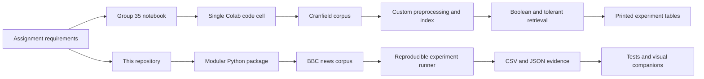

# Comparison with the Group 35 IR Assignment Notebook

## Scope

This document compares the approach used in the external
[Group35 IR Assignment notebook](https://github.com/ghoshabhishek-bitswilp/IR_Assignment1_Group35/blob/main/Group35_IR_Assignment1.ipynb)
with the implementation in this repository. The comparison is based on the
requirements transcribed in [IR_Assignment.md](IR_Assignment.md), the notebook's
source and saved outputs, and this repository's source code, generated results,
and tests.

These are implementation review notes, not the technical report required for
submission.

## Approach Overview



## Overall Assessment

This repository is substantially stronger technically. The Group 35 notebook
is convenient for a Virtual Lab demonstration, but several of its evaluation
results are invalid because of Boolean retrieval and experimental-design
problems.

| Area | Group 35 notebook | This repository |
| --- | --- | --- |
| Dataset | 1,400 Cranfield aerospace documents | 2,225 BBC news articles in five categories |
| Structure | Nearly all logic in one Colab code cell | Separate corpus, preprocessing, index, Boolean, tolerant, and evaluation modules |
| Preprocessing | Five stages, custom stopwords, and a rule-based "lemmatizer" | Five configurations, NLTK stopwords and WordNet, with an explicit library boundary |
| Porter stemming | Claims the complete algorithm but omits canonical steps and rules | Implements the complete 1980 sequence, traces each step, and compares against NLTK |
| Boolean parsing | Shunting-yard conversion to postfix | Recursive-descent parser producing a validated expression tree |
| Boolean correctness | `OR` merge is incorrect | Correct and tested `AND`, `OR`, and difference merges |
| Optimization | Four selected conjunctions | All 30 queries across all five index configurations |
| Tolerant retrieval | 2-grams and edit distance over the stemmed vocabulary | 3-grams and edit distance over surface vocabulary, followed by stemming |
| Evaluation | Relevance data derived from the index being evaluated | Separate lexical relevance predicates evaluated over raw documents |
| Evidence | Printed notebook output | Reproducible CSV and JSON outputs plus HTML companions |
| Tests | No test suite | 101 passing tests |
| Submission packaging | Executable notebook | Strong implementation, but the report and Virtual Lab screenshot remain absent |

## Critical Problems in the Notebook

### 1. The `OR` operation is incorrect

When the two current document IDs differ, the notebook advances a pointer but
does not append the smaller ID to the result. It therefore retains matching IDs
and the remaining tail rather than constructing a proper union.

The saved output demonstrates the contradiction:

- `pressure` retrieves 543 documents.
- `pressure OR velocity` retrieves only 147 documents.

A valid union cannot contain fewer documents than either operand. This defect
also invalidates compound and nested queries containing `OR`.

The implementation in `src/ir/boolean.py` appends the smaller document ID during
each merge step and has a direct unit test for the expected union.

### 2. Evaluation uses circular relevance judgments

The notebook constructs its so-called ground truth by collecting postings for
the query terms from the same production index being evaluated. It also combines
those postings with a union regardless of the query's Boolean structure.

Consequently, an `AND` result will generally be a subset of the generated
ground truth. This explains why almost every notebook query reports precision
of `1.0`; the score does not independently measure retrieval quality.

This repository defines relevance predicates in `src/ir/queryset.py` and applies
them to raw article text. Retrieval is evaluated separately over processed
indexes. These judgments remain lexical rather than semantic, but they do not
simply reuse the evaluated system's result set.

### 3. Empty retrieval can receive a perfect score

The notebook sets precision to `1.0` when no documents are retrieved and recall
to `1.0` when its generated ground truth is empty. For example,
`supersonik AND shok` retrieves zero documents but receives precision, recall,
and F1 of `1.0`.

This repository returns zero for undefined no-evidence cases and tests those
boundary conditions in `tests/test_retrieval.py`.

### 4. The claimed Porter implementation is incomplete

The notebook describes its stemmer as Porter's 1980 algorithm from Steps 1a
through 5. The visible implementation performs Steps 1a, 1b, 1c, 2, and 4, but
omits canonical Step 3, Step 5a, and Step 5b, along with some suffix rules and
conditions.

This repository's `src/ir/porter.py` implements Steps 1a through 5b. Its tests
cover published examples, measure calculations, known limitations, and greater
than 99% agreement with NLTK's original-algorithm mode over a corpus vocabulary
sample.

### 5. Spell correction is performed against stems

The notebook builds its tolerant retrieval vocabulary from stemmed index terms
and also stems misspellings before correction. A misspelled surface form can
collapse to an existing stem, causing the corrector to treat it as valid and
skip the intended word.

The notebook reports only 55% correction accuracy, or 11 correct terms out of
20. This repository repairs terms against the unstemmed surface vocabulary and
only then passes the repaired query through the index normalizer.

### 6. The offline fallback changes the dataset silently

If the notebook cannot download Cranfield, it generates 1,400 documents by
repeating five short templates and proceeds as though it had loaded Cranfield.
That fallback changes vocabulary diversity, document-length distribution,
postings, evaluation, and timing while retaining the original dataset label.

A reproducible experiment should fail with an actionable dataset error or
clearly identify the synthetic run as a different experiment.

## Strengths of This Repository

### Boolean retrieval

`src/ir/boolean.py` provides:

- Correct two-pointer intersection, union, and difference operations.
- Operator precedence `NOT > AND > OR`.
- Parentheses and implicit `AND` support.
- Syntax errors for malformed expressions.
- Optimization by estimated postings-list size.
- Deferred negation using difference rather than always materializing a full
  complement.
- A correctness gate requiring optimized and unoptimized execution to return
  identical result sets.

### Preprocessing and Porter stemming

`src/ir/preprocess.py` exposes five reproducible configurations: raw,
normalized, stop-word removal, stemming, and lemmatization. It also distinguishes
locally implemented functionality from NLTK-provided stopwords and WordNet
lemmatization.

`src/ir/porter.py` follows the published 1980 rules and records each intermediate
step for worked examples. The test suite also documents real Porter limitations
instead of presenting every aggressive transformation as a successful lemma or
stem.

### Tolerant retrieval

`src/ir/tolerant.py` uses a shared k-gram index for wildcard lookup and spelling
correction. It shortlists candidates with 3-gram overlap, applies capped
Levenshtein distance, and uses collection frequency to resolve ambiguous
candidates.

The generated tolerant-retrieval results retain incorrect repairs such as
`pirce -> piece` and `sahres -> sales`. These failures provide useful evidence
for the required false-positive and error analysis.

### Reproducible experiments

`experiments/run_experiments.py` produces all downstream CSV, JSON, trace, and
sample-postings files. This avoids manually copying numbers into visualizations
or a report.

The current generated results include:

- Boolean comparisons reduced from 77,943 to 21,790, a 72.04% saving.
- Tolerant macro recall improved from 0.1326 to 0.8543.
- Tolerant micro F1 improved from 0.3662 to 0.9047.
- Vocabulary and postings statistics for all five preprocessing configurations.

### Verification

The test suite covers preprocessing behavior, postings invariants, parser
precedence and errors, Boolean merge correctness, optimization equivalence,
Porter rules, edit distance, k-grams, wildcard retrieval, spelling repair, and
evaluation arithmetic.

Verification performed during this comparison:

```text
101 passed in 59.54s
```

## Useful Ideas to Adopt from the Notebook

The notebook's main advantage is presentation and execution convenience:

- It maps printed sections directly to assignment requirements.
- It runs the complete demonstration from one visible entry point.
- It prints compact tables suitable for a Virtual Lab screenshot.
- It keeps dataset attribution near the execution output.

This repository should preserve its modular implementation while adding a thin
demonstration entry point or notebook that calls the existing modules. Logic and
experimental results should continue to live in tested source files and
generated artifacts rather than being duplicated inside the notebook.

Cranfield itself is also a defensible dataset choice because it is a canonical
IR test collection with established queries and relevance judgments. The Group
35 notebook does not use those official judgments, which wastes the collection's
main evaluation advantage.

## Remaining Submission Gaps

> **Status: gaps 1, 2, 4 and 5 below have since been closed.** The technical
> report now exists at `docs/report/technical_report.md`, `demo.py` is the
> single demonstration command, and `wordnet`/`omw-1.4` are present under
> `nltk_data/`. Only gap 3 still stands, and §6.4 of the report states it.

The following gaps are independent of implementation quality and could still
lose marks:

1. ~~No technical report is currently present in the repository.~~ Closed:
   `docs/report/technical_report.md` covers methodology, experimental setup,
   results, error analysis, conclusion, calculations, tables and plots, sample
   postings and Boolean query traces.
2. No Virtual Lab execution screenshot is currently present.
3. The relevance judgments are reproducible lexical judgments rather than
   human semantic judgments. The report should state this limitation and should
   ideally include a small manual audit.
4. ~~WordNet data is not present under the repository's bundled `nltk_data`
   directory.~~ Closed: `wordnet.zip` and `omw-1.4.zip` are bundled, and
   `src/ir/__init__.py` registers the directory on import.
5. ~~A notebook or concise demonstration command would simplify Virtual Lab
   execution and screenshot capture.~~ Closed: `python demo.py`.

## Recommended Direction

Do not replace this repository's implementation with the notebook's monolithic
approach. Retain the tested modules and reproducible experiment artifacts. Adopt
only the notebook's useful presentation pattern by adding a demonstration layer
that invokes the existing code, prints assignment-aligned headings and tables,
and is straightforward to run in the BITS Virtual Lab.
