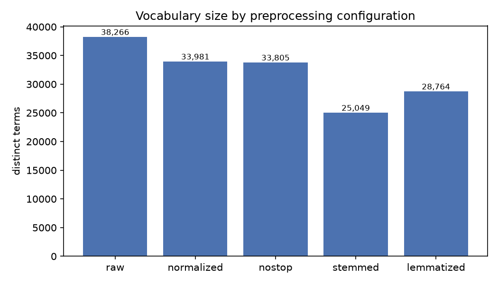
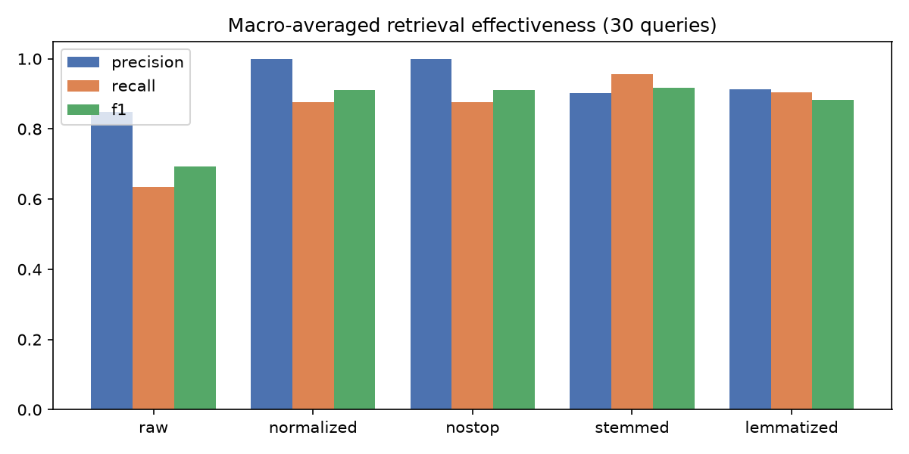
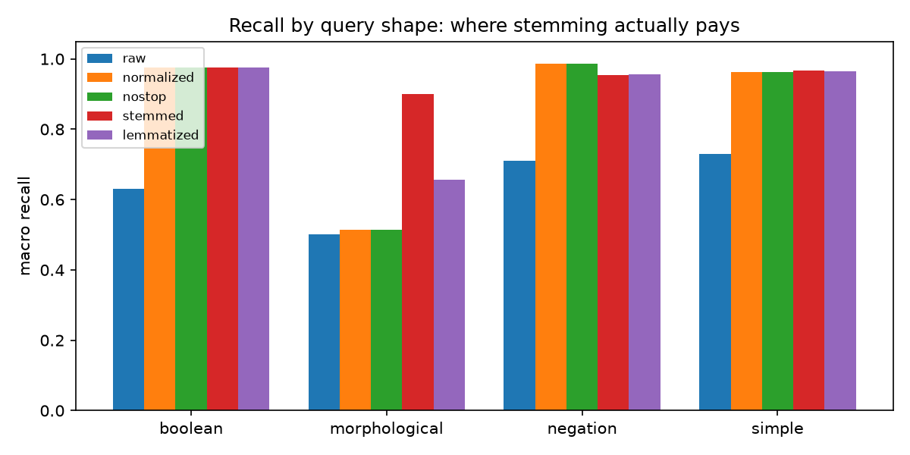
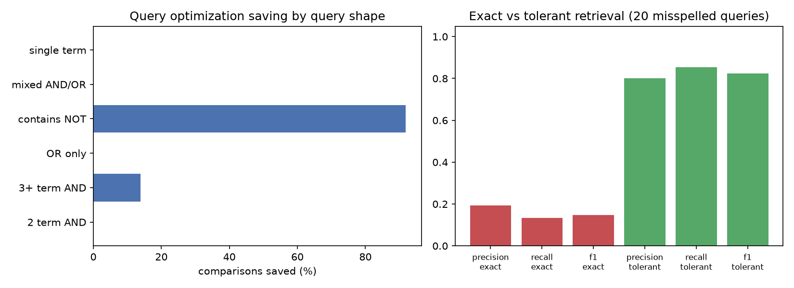

# Technical Report

**Building a Boolean Retrieval System with Vocabulary Processing and Tolerant Retrieval**

Corpus: BBC News full-text (2,225 articles) · 33 test queries · 20 misspelled variants

All figures and tables in this report are generated by `experiments/run_experiments.py`
and read from `data/derived/`. No number below was transcribed by hand.

---

## 1. Problem Statement

The task is to build a complete Boolean information retrieval pipeline over a
single-domain document collection:

```
Documents → Preprocessing → Vocabulary/Dictionary → Inverted Index → Postings Lists
          → Boolean Retrieval → Tolerant Retrieval → Evaluation
```

Concretely the system must transform raw articles into a term dictionary and an
inverted index, answer Boolean queries (`AND`, `OR`, `NOT`, parentheses) using
its own postings lists, tolerate spelling and morphological variation, and be
evaluated with precision, recall and F1 against relevance judgments.

Two constraints shape the design. First, the Boolean operations must run over
postings lists the system itself constructed — no set operations on Python sets
standing in for a merge. Second, no pre-built search engine or LLM retrieval
system may sit in the retrieval path.

---

## 2. Dataset

| Property | Value |
| --- | --- |
| Name | BBC News full-text corpus |
| Domain | News — a single domain with five sub-topics |
| Source | UCD Machine Learning Group — <http://mlg.ucd.ie/datasets/bbc.html> |
| Download | `bbc-fulltext.zip` |
| Attribution | D. Greene and P. Cunningham, *"Practical Solutions to the Problem of Diagonal Dominance in Kernel Document Clustering"*, Proc. ICML 2006 |
| Licence | Article content copyright BBC; released for non-commercial research use only |
| Documents | 2,225 |
| Corpus size | 5,041,385 bytes (5.0 MB) |
| Tokens | 854,490 (whitespace split, before processing) |
| Unique types | 65,553 (whitespace split, before processing) |

Document length varies substantially, which is why this corpus was chosen over
abstract collections such as Cranfield:

| Statistic | Words |
| --- | --- |
| Minimum | 89 |
| Median | 332 |
| Mean | 384.0 |
| Maximum | 4,432 |

Sub-topic distribution: business 510, entertainment 386, politics 417,
sport 511, tech 401.

The corpus ships no relevance judgments, so all 33 queries and their judgments
are authored here (§4.3). That is required by the assignment in any case.

Provenance is recorded in code (`src/ir/corpus.py`, `DATASET`) so it is emitted
into `data/derived/corpus_stats.json` and `summary.json` on every run.

---

## 3. System Methodology

### 3.1 Module map

| Module | Responsibility |
| --- | --- |
| `src/ir/corpus.py` | Load and profile the collection. Does no text processing. |
| `src/ir/preprocess.py` | Five named, reproducible preprocessing configurations. |
| `src/ir/porter.py` | Porter's 1980 stemming algorithm, implemented from the paper. |
| `src/ir/dictionary.py` | Sorted vocabulary with document and collection frequency. |
| `src/ir/index.py` | Inverted index construction, sorted postings, invariant checks. |
| `src/ir/boolean.py` | Query parser, postings merges, two execution strategies. |
| `src/ir/tolerant.py` | k-gram index, wildcard lookup, Levenshtein correction. |
| `src/ir/morphology.py` | Probes that expose over- and under-stemming. |
| `src/ir/evaluate.py` | Set-based precision, recall, F1; macro and micro averaging. |
| `src/ir/queryset.py` | The 33 queries, their gold predicates, the 20 misspellings. |

### 3.2 Text processing

Tokenization uses a single regular expression,
`[A-Za-z0-9]+(?:['\-][A-Za-z0-9]+)*`, which keeps intra-word apostrophes and
hyphens so `don't` and `Netherlands-based` survive as one token each. Numbers
with separators are split (`45,000` → `45`, `000`) — a known, reported loss.

Five configurations are defined, each a superset of the last:

| Name | Lowercase | Stop-words removed | Stemmed | Lemmatized |
| --- | --- | --- | --- | --- |
| `raw` | — | — | — | — |
| `normalized` | yes | — | — | — |
| `nostop` | yes | yes | — | — |
| `stemmed` | yes | yes | Porter | — |
| `lemmatized` | yes | yes | — | WordNet + POS |

Worked example — input
`"The Investors were ANNOUNCING new investments in US technologies."`:

```
raw         ( 9) The Investors were ANNOUNCING new investments in US technologies
normalized  ( 9) the investors were announcing new investments in us technologies
nostop      ( 6) investors announcing new investments us technologies
stemmed     ( 6) investor announc new invest us technologi
lemmatized  ( 6) investor announce new investment u technology
```

**Ordering decision.** In the `lemmatized` configuration, POS tagging and
lemmatization run *before* stop-word removal. The tagger needs the function
words around a token to decide its part of speech; deleting them first destroys
the context the tagger depends on.

**Why POS tagging matters.** `WordNetLemmatizer.lemmatize(token)` defaults to
`pos='n'`. Under that default *no verb is ever lemmatized*: `announced` stays
`announced` and `winning` stays `winning`, and the "lemmatized" index degenerates
into plural stripping. Tagging first is what makes the stemming-vs-lemmatization
comparison in §5.3 an actual comparison. `tests/test_retrieval.py::test_lemmatizer_is_pos_aware`
pins this.

### 3.3 Porter stemming

Implemented directly from M.F. Porter, *"An algorithm for suffix stripping"*,
Program 14(3), 1980. A word is read as `[C](VC){m}[V]`; most rules fire only
when the surviving stem has a large enough measure `m`, which is what stops the
stemmer eating short words. All five steps (1a, 1b, 1c, 2, 3, 4, 5a, 5b) are
present and each records its intermediate result.

Sample traces (`data/derived/porter_traces.txt`):

```
relational     input:relational -> 1a:relational -> 1b:relational -> 1c:relational
                              -> 2:relate -> 3:relate -> 4:relate -> 5a:relat -> 5b:relat
investments    input:investments -> 1a:investment -> ... -> 4:invest -> 5b:invest
announced      input:announced -> 1a:announced -> 1b:announc -> ... -> 5b:announc
technologies   input:technologies -> 1a:technologi -> ... -> 5b:technologi
```

The implementation is validated against NLTK's `PorterStemmer` as an independent
oracle over a sample of the real corpus vocabulary
(`tests/test_porter.py::test_agreement_with_nltk_on_corpus_vocabulary`). Known,
deliberate divergences on two-letter words follow Porter's published reference
rather than NLTK's variant and are documented in the test suite.

### 3.4 Dictionary, inverted index and postings lists

The dictionary (`Vocabulary`) holds the sorted term list, document frequency and
collection frequency. It is kept separate from the postings because in a real
system the dictionary fits in memory and the postings do not; here the split
also lets dictionary statistics be quoted independently.

Postings are lists of document IDs, stored **strictly ascending and
duplicate-free**. That invariant is what allows every merge in §3.5 to run in a
single linear pass. It is enforced, not assumed: `InvertedIndex.check_invariants()`
raises if any list is unsorted, contains a duplicate, references a document ID
out of range, or disagrees with the recorded `df`. It is called on every index
the experiment runner builds.

Sample postings lists from the stemmed index
(`data/derived/postings_samples.txt`):

```
oil       -> df=110 -> [2, 8, 11, 15, 21, 23, 24, 27, 29, 44, ... (+100 more)]
elect     -> df=237 -> [6, 34, 75, 101, 105, 106, 120, 135, 153, 164, ... (+227 more)]
broadband -> df=72  -> [0, 111, 123, 251, 1004, 1828, 1834, 1841, 1844, 1846, ... (+62 more)]
chelsea   -> df=68  -> [39, 1078, 1141, 1409, 1413, 1414, 1416, 1422, 1423, 1424, ... (+58 more)]
technolog -> df=16  -> [233, 544, 657, 1111, 1832, 1922, 1926, 1933, 1960, 2023, ... (+6 more)]
```

The `broadband` and `chelsea` lists show the corpus is ordered by category:
`chelsea` is dense in the 1400s (sport) and `broadband` in the 1800s (tech).

### 3.5 Boolean retrieval

**Parsing.** A recursive-descent parser produces an expression tree. Precedence
is `NOT` > `AND` > `OR`; parentheses override it; adjacent operands with no
operator between them are treated as `AND`, so `oil price` and `oil AND price`
mean the same thing. Malformed queries raise `QuerySyntaxError` rather than
returning a plausible wrong answer.

**Merges.** Three two-pointer primitives over sorted postings lists, each
counting its comparisons:

- `intersect(a, b)` — `AND`
- `union(a, b)` — `OR`
- `difference(a, b)` — `a AND NOT b`

`difference` is the important one. The textbook reading of `NOT b` is "every
document not in `b`", which would mean materialising a 2,225-element complement
before intersecting. `difference` walks `a` and `b` together and never builds the
complement at all.

**Wildcards.** A query token containing `*` parses to its own `Wildcard` node.
Expanding it needs the k-gram index, which `boolean.py` does not own, so
`execute()` takes an optional `expand` callback. Without one, a wildcard is a
syntax error. This is deliberate: silently discarding the `*` would turn
`comput*` into a lookup for the literal term `comput`, return zero documents, and
look like a legitimate empty result rather than a bug.

**Two execution strategies.**

- *naive* — evaluate `AND` arguments left to right, exactly as written.
- *optimized* — sort `AND` arguments by increasing estimated postings length,
  and defer `NOT` arguments so they can be answered with `difference()`.

Both must return identical result sets. That equality is asserted for every
query in every index before any comparison count or timing is recorded; the
performance numbers are meaningless without it.

### 3.6 Tolerant retrieval

A single 3-gram index over the **surface** vocabulary (33,805 terms, 10,582
distinct k-grams) serves both requirements. Terms are padded, `$term$`, so a
k-gram can anchor to a word boundary.

*Wildcards* are answered in two stages. The k-gram postings of the pattern's
literal runs are intersected, then survivors are filtered with a regex. Both
stages are needed: `re*val` shares k-grams with terms that put the pieces in the
wrong order, and only the regex removes them.

*Misspellings* are answered by shortlisting candidates that share a 3-gram with
the query term, then ranking the shortlist by Levenshtein distance (two-row DP
with an early-exit cap). Ties are broken toward the commoner word, because pure
edit distance is frequency-blind.

**Correction runs before stemming, over the surface vocabulary.** This is the
subtlest decision in the system. Porter reduces the misspelling `goverment` to
`gover`, which exists in the stemmed dictionary as a term in its own right — so a
corrector consulting the stemmed vocabulary would conclude the word is spelled
correctly, decline to repair it, and silently return nothing.
`tests/test_retrieval.py::test_correction_must_run_before_stemming` pins this.

### 3.7 Evaluation metrics

Boolean retrieval returns an unranked set, so the set-theoretic definitions are
used. For a query with retrieved set $R$ and relevant set $G$:

$$P = \frac{|R \cap G|}{|R|} \qquad
  R_{ec} = \frac{|R \cap G|}{|G|} \qquad
  F_1 = \frac{2 P R_{ec}}{P + R_{ec}}$$

Undefined cases (empty retrieval, empty gold) return 0, not 1. Reporting 1.0 for
a query that retrieved nothing is a common way to manufacture a perfect score.

Both averages are reported because they answer different questions. Macro is the
mean of per-query scores — every query counts once. Micro pools the counts
first — every document decision counts once, so large result sets dominate.

---

## 4. Experimental Setup

### 4.1 Environment

| Item | Value |
| --- | --- |
| Language | Python 3.14 |
| Libraries | `nltk` (data + tagger + lemmatizer), `matplotlib` (figures), `pytest` (tests) |
| NLTK data | Bundled in `nltk_data/` — `stopwords`, `punkt`, `wordnet`, `omw-1.4`, `averaged_perceptron_tagger` |
| Entry points | `python demo.py` (demonstration), `python experiments/run_experiments.py` (full results) |
| Test suite | 109 tests, all passing |

NLTK data is bundled rather than downloaded at run time so the system runs on a
clean Virtual Lab machine with no network access.

### 4.2 Measurement protocol

**Comparison counts** are exact: every iteration of every merge loop increments a
counter, so the number is deterministic and reproducible.

**Timings** are the median of 9 runs, after two warm-up runs, with the two
strategies *alternating* which one goes first on each repeat. This matters. An
earlier version of this experiment timed one un-repeated run with the naive
strategy always first, and reported that the optimized strategy was 3× faster on
single-term queries — queries that perform zero merges and where the two
strategies execute identical code. The entire "speed-up" was the first run paying
to pull postings into cache. Under the current protocol those queries correctly
report 0.0014 ms for both.

### 4.3 Query set and relevance judgments

33 queries across four shapes, plus 20 misspelled variants:

| Shape | Count | Example |
| --- | --- | --- |
| simple | 8 | `oil` |
| boolean | 15 | `(microsoft OR apple) AND software`, `market AND prices AND oil AND gas` |
| negation | 3 | `bank AND NOT football` |
| morphological | 7 | `investment`, `computing` |
| **misspelled** | **20** | `goverment AND economy`, `sahres AND profits` |

Relevance judgments are **executable predicates over the raw article text**,
using whole-word case-insensitive matching, producing 5,141 judgments. For
example `q09 = oil AND price` is judged relevant to any article containing both
whole words. Morphological queries use a word family: `q24 = investment` is
judged relevant to any article containing *invest, invests, invested, investing,
investment* or *investments*.

Two properties make this defensible, and one makes it limited:

- Retrieval runs over a **processed** index; judgments run over **raw** text. The
  two are on different footings, so the evaluation is not scoring the system
  against its own output.
- Judgments are deterministic and reproducible; `queries/qrels.tsv` is
  regenerated on every run.
- **But they are lexical, not semantic.** An article genuinely about the oil
  market that never writes the word "oil" is counted non-relevant. This inflates
  precision and deflates recall relative to human judgment, uniformly across all
  five systems. See §6.4.

The three multi-term `AND` queries (q31–q33) are written **largest postings list
first**. That is the worst case for left-to-right evaluation and the case the
optimizer exists to fix; without them the query set contains nothing to reorder
(§5.4).

---

## 5. Results

### 5.1 Experiment 1 — effect of preprocessing on vocabulary and index

`data/derived/index_stats.csv`

| Configuration | Vocabulary | Postings | Tokens indexed | Hapax legomena | Mean df |
| --- | ---: | ---: | ---: | ---: | ---: |
| raw | 38,266 | 474,642 | 854,987 | 14,699 | 12.40 |
| normalized | 33,981 | 457,500 | 854,987 | 12,703 | 13.46 |
| nostop | 33,805 | 356,386 | 497,333 | 12,697 | 10.54 |
| stemmed | **25,049** | 335,223 | 497,333 | 9,505 | 13.38 |
| lemmatized | 28,764 | 337,183 | 497,275 | 11,282 | 11.72 |



Reading the table step by step:

- **Case normalization** removes 4,285 terms (11.2%) by merging `Steel`/`steel`
  and every sentence-initial variant. Token count is unchanged — nothing is
  deleted, only merged.
- **Stop-word removal** deletes 357,654 tokens (41.8% of the collection) but only
  176 terms. That asymmetry is the whole point of a stop list: 176 terms account
  for two fifths of the text. Postings drop 22.1%, which is where the index-size
  saving comes from.
- **Stemming** removes a further 8,756 terms (25.9%) — the largest vocabulary
  reduction of any single step — and cuts hapax legomena by 25.1%, because many
  once-only words are inflections of words seen elsewhere.
- **Lemmatization** removes 5,041 terms (14.9%), roughly 58% of what stemming
  removes. It is more conservative by construction: it only maps a word to
  another *real* word.

The `raw` and `normalized` rows show 854,987 tokens against the corpus profile's
854,490 whitespace tokens. The gap is the tokenizer splitting `45,000` and
`$4.5bn`, and is itself a reportable result.

### 5.2 Experiment 2 — retrieval quality per configuration

`data/derived/evaluation_summary.json` — 33 queries.

| Configuration | Macro P | Macro R | Macro F1 | Micro P | Micro R | Micro F1 |
| --- | ---: | ---: | ---: | ---: | ---: | ---: |
| raw | 0.8482 | 0.6343 | 0.6929 | 0.9993 | 0.5797 | 0.7337 |
| normalized | **1.0000** | 0.8756 | 0.9104 | **1.0000** | 0.7199 | 0.8371 |
| nostop | **1.0000** | 0.8756 | 0.9104 | **1.0000** | 0.7199 | 0.8371 |
| stemmed | 0.9028 | **0.9554** | **0.9178** | 0.9371 | **0.8952** | **0.9156** |
| lemmatized | 0.9140 | 0.9035 | 0.8834 | 0.9190 | 0.8170 | 0.8650 |



- `raw` loses recall badly (0.634): a query for `oil` cannot match `Oil` at the
  start of a sentence.
- `normalized` and `nostop` are **identical**. None of the 33 queries contains a
  stop word, so removing them changes no result. Stop-word removal is an index
  *size* optimisation here, not an effectiveness one — worth stating plainly
  rather than implying it helps retrieval.
- `stemmed` gives the best F1, trading 9.7 points of precision for 8.0 points of
  recall over `nostop`.

### 5.3 Experiment 3 — stemming vs lemmatization

The headline averages hide where the effect is. Breaking recall down by query
shape (`data/derived/evaluation_by_kind.csv`):

| Index | simple | boolean | negation | **morphological** |
| --- | ---: | ---: | ---: | ---: |
| normalized / nostop | 0.9624 | 0.9759 | 0.9867 | **0.5137** |
| lemmatized | 0.9652 | 0.9759 | 0.9554 | **0.6556** |
| stemmed | 0.9669 | 0.9759 | 0.9530 | **0.8993** |



**Stemming's entire advantage lives in the 7 morphological queries** (+0.386
recall). On the other 26 it is level or marginally worse, and on `boolean`
queries it *costs* precision (0.841 vs 1.000) because conflated terms retrieve
documents that use a different sense.

Conflation strength, over the 33,805-term `nostop` vocabulary:

| Method | Groups | Mean surface forms per group |
| --- | ---: | ---: |
| Porter stem | 25,049 | 1.35 |
| WordNet lemma | 27,131 | 1.25 |

The largest stem groups (`data/derived/stem_vs_lemma.csv`) show both the benefit
and the danger:

| Stem | Forms | Distinct lemmas | Ratio | Members (sample) |
| --- | ---: | ---: | ---: | --- |
| `gener` | 14 | 8 | 1.75 | general generalities generally generate generation generations generic |
| `consult` | 10 | 5 | 2.00 | consult consultancy consultant consultation consulting consults |
| `commun` | 9 | 6 | 1.50 | communicate communication communications **communism communities community** |
| `oper` | 9 | 5 | 1.80 | operate operating operation operational operator operators |

The ratio is how much more aggressively the stemmer merges than the lemmatizer.
`commun` is the clearest damage: it puts *communism* in the same postings list as
*community*.

#### Undesirable transformations

`data/derived/morphology_probes.csv` runs the real stemmer and the real
lemmatizer over hand-chosen probe pairs and derives the verdict. 12 of 16 probes
are undesirable transformations.

**Over-stemming** — words a searcher would not want merged, merged anyway:

| Word A | Word B | Stem | Lemmas | Verdict |
| --- | --- | --- | --- | --- |
| communism | community | `commun` | communism / community | over-stemming: only the stemmer merges |
| university | universe | `univers` | university / universe | over-stemming: only the stemmer merges |
| generic | generation | `gener` | generic / generation | over-stemming: only the stemmer merges |
| dominance | dominic | `domin` | dominance / dominic | over-stemming: only the stemmer merges |
| news | new | `new` | news / new | over-stemming: only the stemmer merges |

`news` → `new` is the most damaging of these on a news corpus: every article
containing the word "new" is merged into the postings list a user searching for
"news" will reach.

**Under-stemming** — words a searcher would want merged, kept apart:

| Word A | Word B | Stems | Lemmas | Verdict |
| --- | --- | --- | --- | --- |
| children | child | `children` / `child` | child / child | only the lemmatizer merges |
| mice | mouse | `mice` / `mous` | mouse / mouse | only the lemmatizer merges |
| ran | run | `ran` / `run` | run / run | only the lemmatizer merges |
| was | be | `wa` / `be` | be / be | only the lemmatizer merges |
| europe | european | `europ` / `european` | europe / european | neither merges |
| analysis | analyses | `analysi` / `analys` | analysis / analyse | neither merges |
| better | good | `better` / `good` | better / good | neither merges |

The pattern is clean and is the standard result: **Porter is a suffix stripper,
so it handles regular morphology and fails on every irregular form; WordNet
handles the irregulars and refuses the aggressive merges.** Porter also produces
non-words (`technologi`, `wa`, `analysi`), which is harmless for matching but
makes an index unreadable.

### 5.4 Experiment 4 — Boolean query optimization

Across 33 queries × 5 indexes = 165 executions:

| Metric | Naive | Optimized | Saving |
| --- | ---: | ---: | ---: |
| Total comparisons | 90,071 | 32,263 | **64.2%** |

That headline is misleading on its own. Broken down by query shape
(`data/derived/optimization_by_shape.csv`):

| Query shape | Executions | Naive | Optimized | Saving |
| --- | ---: | ---: | ---: | ---: |
| single term | 75 | 0 | 0 | — |
| 2-term AND | 40 | 12,102 | 12,102 | **0.0%** |
| OR only | 5 | 805 | 805 | **0.0%** |
| mixed AND/OR | 15 | 4,005 | 4,005 | **0.0%** |
| 3+ term AND | 15 | 12,049 | 10,382 | **13.8%** |
| contains NOT | 15 | 61,110 | 4,969 | **91.9%** |



**The 0.0% rows are correct, not a bug.** A two-pointer intersection of two lists
advances through both exactly once regardless of which is passed first, so its
comparison count is symmetric — reordering a 2-term `AND` *cannot* help. Any
saving reported there would indicate a broken merge.

Almost all of the 64.2% comes from deferring negation. Worked trace for
`q21 = bank AND NOT football` on the stemmed index:

```
naive      bank(186) footbal(114)   4,299 comparisons   0.985 ms
           NOT football materialises the complement: 2,225 - 114 = 2,111 doc IDs,
           then intersects 186 against 2,111.
optimized  bank(186) footbal(114)     293 comparisons   0.077 ms
           difference(bank, football) walks 186 and 114 together. No complement.
```

That is a 93.2% reduction in comparisons and a 12.9× reduction in wall-clock time
for one query.

Reordering an `AND` gives a real but far smaller gain. Worked trace for
`q31 = market AND prices AND oil AND gas`, deliberately written largest-first:

```
naive      market(433) price(245) oil(110) ga(35)    815 comparisons   0.174 ms
optimized  ga(35) oil(110) price(245) market(433)    634 comparisons   0.139 ms
```

Starting from the 35-document list bounds every intermediate result at 35;
starting from the 433-document list does not. Saving: 22.2%.

| Query | Naive cmp | Opt cmp | Naive ms | Opt ms |
| --- | ---: | ---: | ---: | ---: |
| `oil AND price` | 290 | 290 | 0.060 | 0.064 |
| `film AND music AND awards` | 705 | 656 | 0.148 | 0.142 |
| `government AND minister AND election AND labour` | 1,224 | 1,162 | 0.261 | 0.253 |
| `market AND prices AND oil AND gas` | 815 | 634 | 0.174 | 0.139 |
| `bank AND NOT football` | 4,299 | 293 | 0.985 | 0.077 |

Timings track comparison counts closely, which is the expected result: the merge
loop is the dominant cost and it is comparison-bound.

### 5.5 Experiment 5 — exact vs tolerant retrieval

20 deliberately corrupted queries (transposition, omission, doubling,
substitution), scored against the *uncorrupted* query's relevance judgments.

| Mode | Macro P | Macro R | Macro F1 | Micro P | Micro R | Micro F1 |
| --- | ---: | ---: | ---: | ---: | ---: | ---: |
| exact | 0.1937 | 0.1326 | 0.1466 | 0.9838 | 0.2249 | 0.3662 |
| tolerant | **0.8008** | **0.8543** | **0.8237** | 0.9194 | **0.8905** | **0.9047** |

Recall rises 6.4× (0.133 → 0.854). Micro precision falls from 0.984 to 0.919 —
that 6.5-point drop is the false-positive cost of correction, and it is the
trade-off the assignment asks about: **tolerant retrieval buys a large amount of
recall for a small amount of precision.**

Exact micro precision of 0.984 is a statistical artefact, not a strength: 16 of
20 exact queries retrieve *nothing at all*, so almost the only queries
contributing to the pooled precision are the four that happened to work.

Representative rows from `data/derived/tolerant.csv`:

| Query | Repaired to | Exact hits | Tolerant hits | Tolerant P | Tolerant R |
| --- | --- | ---: | ---: | ---: | ---: |
| `brodband` | `broadband` | 0 | 72 | 1.000 | 1.000 |
| `softwear` | `software` | 0 | 135 | 1.000 | 1.000 |
| `goverment AND economy` | `government AND economy` | 0 | 111 | 0.937 | 0.945 |
| `oil AND pirce` | `oil AND **piece**` | 0 | 0 | 0.000 | 0.000 |
| `sahres AND profits` | `**sales** AND profits` | 0 | 62 | 0.307 | 0.514 |
| `election AND labuor` | `election AND **labor**` | 0 | 4 | 0.000 | 0.000 |

The three bold rows are correction failures, analysed in §6.1.

### 5.6 Wildcard retrieval

K-gram expansion over the surface vocabulary
(`data/derived/wildcards.csv`):

| Pattern | Matches | Sample |
| --- | ---: | --- |
| `comput*` | 13 | computational computer computer's computer-based computerised computers |
| `invest*` | 18 | invest invested investigate investigation investors investing |
| `*ology` | 15 | apology biology chronology ecology ideology methodology mythology |
| `re*val` | 3 | removal retrieval revival |
| `gov*ment` | 1 | government |
| `f*ball` | 1 | football |

Wildcards executed inside real Boolean queries against the same postings lists
(`data/derived/wildcard_queries.csv`):

| Query | Hits | Hits if `*` were ignored | Extra docs | Merge order |
| --- | ---: | ---: | ---: | --- |
| `comput* AND security` | 51 | 51 | 0 | `comput*[10 terms](189) secur(283)` |
| `invest* AND NOT football` | 313 | 151 | **162** | `invest*[5 terms](333) footbal(114)` |
| `(broadband OR mobile) AND *phone` | 121 | 115 | 6 | `broadband(72) mobil(132) *phone[10 terms](184)` |
| `elect* AND labour` | 151 | 148 | 3 | `labour(227) elect*[15 terms](350)` |

`comput*` adds nothing over `computer` because Porter already conflates the whole
family to `comput` — an honest finding: **on a stemmed index, prefix wildcards
are largely redundant with stemming.** `invest*` doubles the result set because it
reaches `investigate`/`investigation`, which stem to `investig`, not `invest`.
That is also where prefix wildcards become dangerous: a user searching `invest*`
for financial articles gets police investigations too.

---

## 6. Error Analysis

### 6.1 Spelling correction failures

Three of 20 corrections are wrong, and each fails for a different reason.

**`pirce` → `piece` (should be `price`).** Edit distance is frequency-blind at
the character level: `pirce`→`piece` is one transposition-equivalent edit,
`pirce`→`price` is two. The nearer wrong candidate wins. The frequency tiebreak
in `KGramIndex.nearest` cannot rescue this because it only breaks ties *at equal
distance*, and these distances are not equal. A proper fix is a noisy-channel
model, $\arg\max_c P(c) \cdot P(\text{typo}|c)$, where a channel model that knows
transpositions are cheap would rank `price` first.

**`sahres` → `sales` (should be `shares`).** Same mechanism. `sahres`→`sales` is
distance 2 and `sales` is a very common business term; `sahres`→`shares` is also
distance 2, and the frequency tiebreak picked the more frequent of the two.
Result: precision 0.307 — the query returns real articles, just about the wrong
topic. This is the worst failure mode, because it is silent.

**`labuor` → `labor` (should be `labour`).** Distance 1 either way. The corpus is
British English so `labour` is far commoner, but `labor` also occurs (in American
quotations) above the credibility floor, and the tie broke the wrong way. Only 4
documents are returned. A British-English-first prior would fix this specific
case.

The general lesson: **shortlisting by k-gram overlap is sound; ranking by edit
distance alone is not.** The shortlist recall is fine — the correct word is in
the candidate set in all three failures — so the loss is entirely in ranking.

### 6.2 Over-stemming in retrieval

`stemmed` precision on `boolean` queries is 0.841 against 1.000 for `nostop`. The
mechanism is §5.3's conflation table applied to real queries. `q13 = government
AND economy` stems to `govern AND economi`, and `govern` also holds documents
about *governing*, *governor* and *governance*, several of which discuss the
economy without ever using the word "government". The system is right by its own
rules and wrong by the judgment set.

### 6.3 Case normalization collides `US` with `us`

Lowercasing maps the country `US` onto the pronoun `us`. NLTK's English stop-word
list does *not* contain `us`, so the collision is not even hidden by stop-word
removal: both senses survive merged into one postings list. A query for the
country retrieves every article that merely used the pronoun. This is pinned in
`tests/test_retrieval.py::test_case_normalization_collides_us_with_stopword`. It
is visible in §3.2's worked example, where `US technologies` lemmatizes to
`u technology`.

### 6.4 Limitations of the relevance judgments

Three biases, all of which should be read into every number in §5:

1. **Lexical, not semantic.** An article about the oil market that never writes
   "oil" is judged non-relevant. This deflates recall and inflates precision
   uniformly across all five configurations, so *comparisons* between them remain
   valid even though the absolute values do not transfer to human judgment.
2. **The morphological queries are favourable to stemming by construction.** Gold
   for `q24`–`q30` is defined as exactly the surface family a stemmer conflates.
   Those 7 of 33 queries are where stemming's entire advantage comes from
   (§5.3). A different judgment scheme would shrink that advantage. This is
   disclosed rather than hidden, and §5.3's per-shape table is what makes it
   visible.
3. **No human audit.** The judgments are reproducible but unverified against a
   reader. A small manual audit of, say, 50 judgments would quantify the gap.

### 6.5 Tokenizer losses

`45,000` → `45`, `000` and `$4.5bn` → `4`, `5bn`. Numeric queries are therefore
unreliable. `U.S.` → `U`, `S`, so the abbreviation is destroyed even before
lowercasing. None of the 33 queries is numeric, so this does not affect the
reported scores — but it would affect a financial-figures query on a business
corpus, and the corpus is 23% business.

---

## 7. Library and AI Usage Declaration

### 7.1 Library boundary

| Component | Implementation |
| --- | --- |
| Tokenization | **Ours** — single regular expression |
| Case normalization | **Ours** |
| Stop-word removal | **Ours** (list is NLTK data) |
| Porter stemming | **Ours** — from the 1980 paper, all steps |
| Dictionary / vocabulary / df / cf | **Ours** |
| Inverted index and postings lists | **Ours** |
| Postings invariant checking | **Ours** |
| Boolean parser (recursive descent) | **Ours** |
| `intersect` / `union` / `difference` merges | **Ours** |
| Query optimization and size estimation | **Ours** |
| k-gram index and wildcard matching | **Ours** |
| Levenshtein distance (capped, two-row) | **Ours** |
| Precision / recall / F1, macro and micro | **Ours** |
| English stop-word list | NLTK data (`stopwords`) |
| POS tagger | NLTK (`averaged_perceptron_tagger`) |
| Lemmatizer and `morphy` | NLTK (`WordNetLemmatizer`, `wordnet`) |
| Figures | `matplotlib` |
| Test runner | `pytest` |
| NLTK `PorterStemmer` | **Test oracle only** — never in the retrieval path |

No RAG system, LLM retrieval system, or pre-built search engine (Elasticsearch,
OpenSearch, Lucene, Whoosh) is used anywhere in the retrieval path. Every
retrieval operation runs over postings lists this system built.

### 7.2 AI assistance

> **Complete this section against your course's exact wording before submitting.**
> Implementation in `src/`, `experiments/`, `app/` and `tests/` was produced with
> AI coding-assistant support and subsequently reviewed. The dataset choice,
> query set, relevance-judgment design and the analysis in this report were
> directed by the author. State this in whatever form your submission requires —
> an undeclared assistance is the thing the rule actually prohibits.

---

## 8. Conclusion

1. **Preprocessing is a size/recall trade, not a free win.** Case normalization
   and stop-word removal cut the index by 11% of terms and 25% of postings; only
   normalization improved retrieval, and stop-word removal changed no result at
   all on this query set.

2. **Stemming gives the best overall F1 (0.918) but for one specific reason.**
   Its whole advantage is +0.386 recall on morphological queries; on Boolean
   queries it *costs* 0.16 precision. A system whose users write inflected
   queries should stem; one that needs precise term matching should not.

3. **Porter and WordNet fail in opposite directions.** Porter is a suffix
   stripper: it handles regular morphology and misses every irregular
   (`children`, `mice`, `ran`, `was`), while over-merging unrelated words
   (`communism`/`community`, `news`/`new`). WordNet catches the irregulars and
   refuses the over-merges, but conflates 42% less and needs a POS tagger to work
   at all.

4. **Boolean optimization is overwhelmingly about negation, not ordering.**
   64.2% of comparisons are saved overall, but 91.9% of that comes from answering
   `AND NOT` with a difference walk instead of a materialised complement.
   Reordering a multi-term `AND` saves 13.8%; reordering a two-term `AND` saves
   nothing, and provably cannot.

5. **Tolerant retrieval is a large recall gain for a small precision cost.**
   Recall 0.133 → 0.854 against a 6.5-point micro-precision loss. All three
   correction failures are ranking failures, not shortlisting failures: the right
   word was always among the candidates. The next improvement is a noisy-channel
   ranker, not a bigger candidate set.

6. **Wildcards are largely redundant on a stemmed index** — `comput*` returns
   exactly what `computer` returns — and become risky when they cross a
   morphological boundary the stemmer respects, as `invest*` does by reaching
   `investigation`.

### Reproducing these results

```bash
python demo.py                        # assignment-aligned summary, ~1 minute
python experiments/run_experiments.py # full result set to data/derived + figures
python -m pytest -q                   # 109 tests
```
